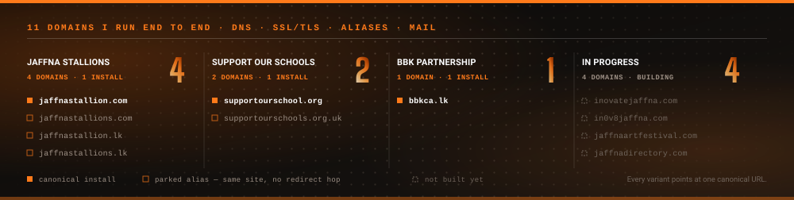

**Jaffna, Sri Lanka** — open to roles in the UK and Europe, and remote freelance work worldwide.

BEng (Hons) Software Engineering — London Metropolitan University (UK), in progress.

# Company work

### BBK Partnership — Software Engineer &amp; Web Developer · Oct 2023 to present

Chartered accountants, three branches — Jaffna, Vavuniya and Colombo — serving 1,000+ companies. Everything in this section was built in my role at the firm. The sites belong to the firm and its partners, not to me; I build them and I keep them running.

<b>Employee attendance &amp; shift platform</b> — internal, in development · Python 3.11 · FastAPI · PostgreSQL 15 · React 18 · Azure · Docker

Internal platform for 200 staff across three branches on six shift patterns running 9am to 1am.

| | |
|---|---|
| **API** | 76 FastAPI routes over 18 PostgreSQL models, behind a service and repository layer so endpoints stay thin |
| **Front end** | 35 React pages, Vite build, trilingual in English, Sinhala and Tamil |
| **Identity** | Microsoft 365 SSO through Azure AD, OTP second factor |
| **Integrations** | Microsoft Teams presence, TSheets time tracking |
| **Async** | Celery for scheduled work, WebSocket for live state, Redis broker |
| **Security** | AES-256 at rest, RBAC with an explicit access matrix, audit log on every action |

The parts that took longest were not the features. Role-based access control is an explicit matrix you can read as a table rather than conditionals scattered through the code, and the audit log exists because in an attendance system the question is never "what is the number" — it is "why is the number that".

<b>Support Our Schools — Sri Lanka Map plugin</b> · PHP · MySQL · REST API · PWA · i18n · Gutenberg

A WordPress plugin that became an application living inside WordPress. Currently v1.45.124 — that number is 124 patch releases of finding out what I got wrong.

| | |
|---|---|
| **Size** | 24,325 lines of PHP across 65 files, 18 module classes, one responsibility each |
| **Data** | 8 custom MySQL tables — schools, campaigns, events, supporters, activity log |
| **Surface** | 28 shortcodes, 30 AJAX endpoints, 7 REST API routes under its own namespace |
| **Roles** | Custom editor role with one capability — content yes, settings and secrets no |
| **No lockout** | Administrators hold that capability implicitly through a `user_has_cap` filter, so a migration or bad deactivation can never strip it and lock everyone out |
| **Offline** | PWA service worker and manifest |
| **Blocks** | Gutenberg blocks for the map and campaign embeds |
| **Ops** | XLSX export, scheduled digests, backup, cross-site sync |
| **Languages** | Full Tamil localisation (ta_LK, ta_IN) alongside English |

It replaced a spreadsheet. What breaks in a spreadsheet is not the data, it is the trail — who verified this school need, when was this donation allocated, which copy of the file is real. So the plugin leaves a record instead of a message thread.

## Every domain I run

| Domain | Serves | Status |
|---|---|---|
| [bbkca.lk](https://bbkca.lk) | BBK Partnership Chartered Accountants | Live · canonical |
| [jaffnastallion.com](https://jaffnastallion.com) | Jaffna Stallions Cricket Academy | Live · canonical |
| jaffnastallions.com | same install as above | Live · parked alias |
| jaffnastallion.lk | same install as above | Live · parked alias |
| jaffnastallions.lk | same install as above | Live · parked alias |
| [supportourschool.org](https://supportourschool.org) | Support Our Schools — education charity | Live · canonical |
| supportourschools.org.uk | same install as above | Live · parked alias |
| inovatejaffna.com | Zoho Mail live, staff mailboxes issued | Site in progress |
| in0v8jaffna.com | — | Site in progress |
| jaffnaartfestival.com | — | Site in progress |
| jaffnadirectory.com | — | Site in progress |

**Why aliases and not 301s.** A 301 sends the visitor somewhere else — second request, extra round trip, every alias a hop away from the real site. A parked domain alias serves the same WordPress install directly. The catch nobody mentions: several domains serving identical content is a duplicate-content problem unless the canonical tag points every variant at one preferred URL. So aliases for speed, canonical tags for search, and one place where the content actually lives.

**Mail.** Zoho Mail on inovatejaffna.com issues multiple staff mailboxes. Every other domain runs Hostinger's one-site-one-mailbox setup.

**Hosting.** Hostinger hPanel throughout — DNS records (A, CNAME, MX), SSL/TLS certificates, parked-domain configuration and mail routing are all mine to manage.

## Results across those builds

| | |
|---|---|
| **90+** | Google PageSpeed on 100% of deployments |
| **8s → under 2s** | load time, by WebP conversion first, then critical CSS inlined, then lazy loading, then server-side caching last |
| **60% faster / 20% lower bounce** | on the 360 Accountants rebuild |
| **150%** | organic search visibility lift for a client |
| **15+** | production sites shipped since 2023, every one from a blank page, every one still maintained |

---

# My own project

### Built solo, outside any company

<b>SmartMed Pharmacy Management System</b> · C# 7.3 · .NET Framework 4.8 · Windows Forms · SQL Server · ADO.NET

No client, no employer, no team. Mine start to finish.

| | |
|---|---|
| **Size** | 446,000 lines of hand-written C# across 871 files and 1,362 classes |
| **Hand-built UI** | Only 2 designer-generated files, so the entire Windows Forms interface is written by hand |
| **Architecture** | Four layers — presentation, service, repository over ADO.NET, data |
| **Components** | Owner-drawn custom control library, one BaseForm page pattern every screen inherits |
| **Auth** | PBKDF2-SHA256 password hashing, TOTP two-factor with QR enrolment |
| **Access** | Role-based access control |
| **Audit** | Hash-chained audit log |
| **Search** | Debounced multi-field search with a Levenshtein fallback; complexity documented |
| **SQL** | Parameterised throughout — 1,674 parameter bindings against 774 command executions |

Why hand-code a WinForms UI: the designer generates code you cannot read and will eventually have to debug, an owner-drawn control library gives you one place to change how everything looks instead of 400 forms each with their own idea, and a BaseForm pattern means a new screen inherits behaviour rather than copying it. The honest caveat — it is slower to start and only pays off past a certain size. Below that, use the designer.

[lojankrish.com](https://lojankrish.com) — my portfolio, also built and hosted by me.

---

# Previously

### 360 Accountants — Web Developer · Mar to Oct 2023

Rebuilt the company website. Pages around 60% faster, bounce rate down about 20%, roughly 50 defects cleared, organic search visibility up 150%, delivered in a fixed window. A different developer has taken it on since, so the live site may no longer be my build.

### Raks Engineering &amp; Technologies (Pvt) Ltd — Work Coordinator · Jan 2021 to Mar 2023

---

## What I work with

| | |
|---|---|
| **Backend & cloud** | Python 3.11 · FastAPI · PostgreSQL · Celery · Redis · WebSocket · Docker · Azure · Azure AD SSO |
| **Front end** | React 18 · Vite · TailwindCSS · JavaScript (ES6+) · HTML5 · CSS3 |
| **WordPress** | Custom themes · plugin engineering · modular components · multi-tenant hosting · Gutenberg blocks |
| **Also** | PHP · C# · .NET Framework · MySQL · SQL Server · MongoDB · REST APIs · Git |
| **Performance & SEO** | Core Web Vitals · critical CSS · WebP · lazy loading · JSON-LD · canonical tags · Search Console |
| **Infrastructure** | hPanel/cPanel · DNS (A/CNAME/MX) · SSL/TLS · parked-domain aliases · Zoho and Hostinger mail |
| **Design** | Canva (advanced, end to end) · Figma (UI layouts and prototypes) · Adobe Photoshop |

## Education

**BEng (Hons) Software Engineering** — ESOFT Metro Campus Jaffna, validated by London Metropolitan University (UK). In progress.

---

## Reach me

[lojankrish.com](https://lojankrish.com) · [LinkedIn](https://linkedin.com/in/lojankrish) · lojankrish360@gmail.com · Jaffna, Sri Lanka
