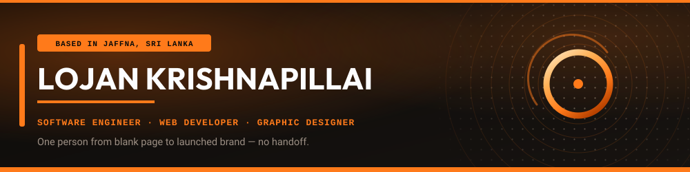
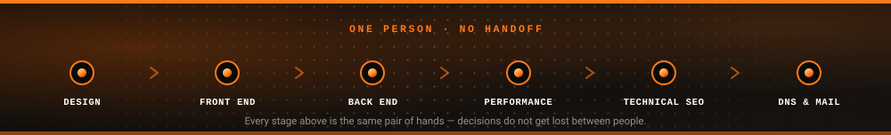
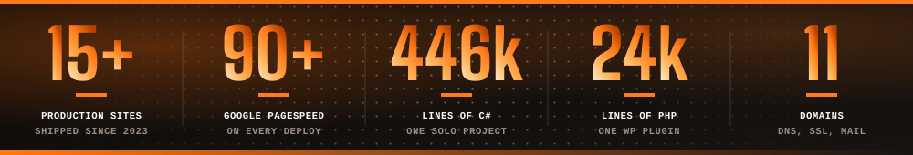
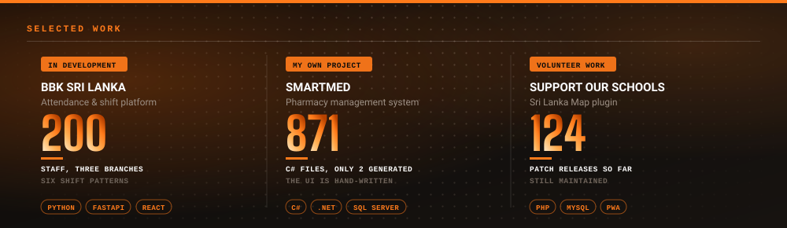

**Jaffna, Sri Lanka** — open to roles in the UK and Europe, and remote freelance work worldwide.

BEng (Hons) Software Engineering — London Metropolitan University (UK), in progress.

# Company work

### BBK Partnership — Software Engineer &amp; Web Developer · Oct 2023 to present

Everything in this section was built in my role at the firm. The sites are the firm's and its partners', not mine — I build and maintain them.

<b>Employee attendance &amp; shift platform</b> — internal, in development · Python · FastAPI · PostgreSQL · React · Azure · Docker

Internal platform for 200 staff across three branches on six shift patterns.

- 76 FastAPI routes over 18 PostgreSQL models, behind a service and repository layer
- 35 React pages; trilingual interface in English, Sinhala and Tamil
- Microsoft 365 SSO through Azure AD with OTP second factor; Microsoft Teams and TSheets integration
- Celery for scheduled work, WebSocket for live state
- AES-256 at rest, role-based access control with an access matrix, audit log on every action

<b>Support Our Schools — Sri Lanka Map plugin</b> · PHP · MySQL · REST API · PWA · i18n

A WordPress plugin that grew into an application. Currently v1.45.124.

- **24,325 lines** of PHP across 65 files, 18 module classes, 8 custom MySQL tables
- 28 shortcodes, 30 AJAX endpoints and 7 REST API routes under its own namespace
- Custom editor role — the content team manages schools, events and campaigns but never settings or secrets, and a `user_has_cap` filter guarantees an administrator can never be locked out
- PWA service worker and manifest, Gutenberg blocks, XLSX export, scheduled digests, backup, cross-site sync
- Full Tamil localisation (ta_LK, ta_IN)

**Live and complete** — every one built from scratch, no pre-existing site, all still maintained by me:

| Site | What it is |
|---|---|
| [bbkca.lk](https://bbkca.lk) | BBK Partnership Chartered Accountants — 1,000+ companies, three branches |
| [jaffnastallion.com](https://jaffnastallion.com) | Jaffna Stallions Cricket Academy — four domains serving one canonical install |
| [supportourschool.org](https://supportourschool.org) | Support Our Schools — education charity, plus the plugin above |

**In progress** — assigned to me, still being built:

`inovatejaffna.com` · `in0v8jaffna.com` · `jaffnaartfestival.com` · `jaffnadirectory.com`

**Also mine to run:** 11 domains end to end — DNS (A/CNAME/MX), SSL/TLS, parked-domain aliases, and mail. Zoho Mail issues staff mailboxes on one domain; the rest run Hostinger mail.

90+ Google PageSpeed on every deployment. Load times down from over 8 seconds to under 2.

---

# My own project

### Built solo, outside any company

<b>SmartMed Pharmacy Management System</b> · C# 7.3 · .NET Framework 4.8 · Windows Forms · SQL Server · ADO.NET

No client, no employer, no team. Mine start to finish.

- **446,000 lines** of hand-written C# across 871 files and 1,362 classes
- Only **2** designer-generated files, so the entire Windows Forms UI is written by hand
- Four layers, repository pattern over ADO.NET, owner-drawn custom control library
- PBKDF2-SHA256 hashing, TOTP two-factor with QR enrolment, RBAC, hash-chained audit log
- Debounced multi-field search with a Levenshtein fallback; complexity documented

[lojankrish.com](https://lojankrish.com) — my portfolio site, also built and hosted by me.

---

# Previously

**360 Accountants** — Web Developer, Mar to Oct 2023. Rebuilt the company site: pages around 60% faster, bounce rate down about 20%, 50-odd defects cleared, organic search visibility up 150%. A different developer has taken it on since, so the live site may no longer be my build.

**Raks Engineering &amp; Technologies** — Work Coordinator, Jan 2021 to Mar 2023.

---

## What I work with

| | |
|---|---|
| **Backend & cloud** | Python 3.11 · FastAPI · PostgreSQL · Celery · Redis · WebSocket · Docker · Azure · Azure AD SSO |
| **Front end** | React 18 · Vite · TailwindCSS · JavaScript (ES6+) · HTML5 · CSS3 |
| **WordPress** | Custom themes · plugin engineering · modular components · multi-tenant hosting |
| **Also** | PHP · C# · .NET Framework · MySQL · SQL Server · MongoDB · REST APIs · Git |
| **Performance & SEO** | Core Web Vitals · critical CSS · WebP · JSON-LD · canonical tags · Search Console |
| **Infrastructure** | hPanel/cPanel · DNS (A/CNAME/MX) · SSL/TLS · domain aliases · Zoho and Hostinger mail |
| **Design** | Canva (advanced, end to end) · Figma (UI layouts and prototypes) · Adobe Photoshop |

---

## Reach me

[lojankrish.com](https://lojankrish.com) · [LinkedIn](https://linkedin.com/in/lojankrish) · lojankrish360@gmail.com
